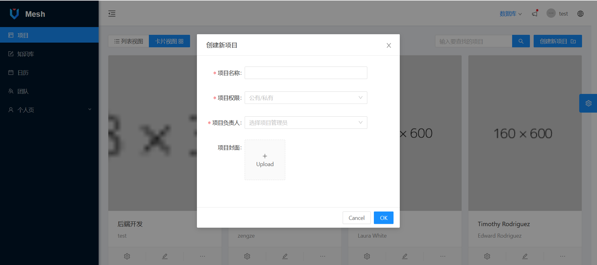
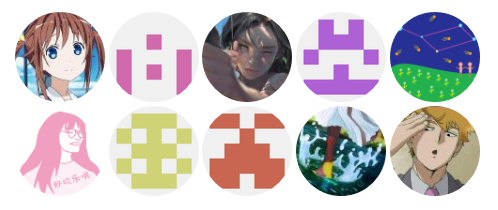

<h1 align="center">Mesh</h1>
<div align="center">
基于 AntD Vue Pro 构建的项目管理工具（前端部分）
</div>

<div align="center">

[](https://github.com/vueComponent/ant-design-vue-pro/blob/master/LICENSE)
[?branchName=master)](https://dev.azure.com/moreonenight/mesh/_build/latest?definitionId=2&branchName=master)
[](#contributors-)

</div>

- 预览网址：https://meshproject.me
- **注意：由于项目前后端目前尚未对接，前述预览网页使用了 Mock.js 来展示数据，测试用用户名 test，密码 test**
- **注意：在向 master 分支 push 代码后，前述网址也会在大约几分钟后自动更新。master 分支出现绿色对号表示更新完成**

项目界面总览
----



### 环境与依赖

- node
- yarn
- webpack
- eslint
- @vue/cli ~3
- [ant-design-vue](https://github.com/vueComponent/ant-design-vue) - Ant Design Of Vue 
- [vue-cropper](https://github.com/xyxiao001/vue-cropper) - Picture edit
- [@antv/g2](https://antv.alipay.com/zh-cn/index.html) - AntV G2
- [Viser-vue](https://viserjs.github.io/docs.html#/viser/guide/installation)  - Antv/G2 of Vue

> 注意：推荐使用 [Yarn](https://yarnpkg.com/) 进行包管理，但也可以使用 npm


### 项目设置

- 克隆仓库
```bash
git clone https://github.com/vueComponent/ant-design-vue-pro.git
cd ant-design-vue-pro
```

- 安装依赖
```
yarn install
```

- 编译并运行测试环境
```
yarn run serve
```

- 为生产环境编译
```
yarn run build
```

- 修复文法错误
```
yarn run lint
```

## 浏览器支持

支持 IE10 和现代浏览器。

| [](http://godban.github.io/browsers-support-badges/)</br>IE / Edge | [](http://godban.github.io/browsers-support-badges/)</br>Firefox | [](http://godban.github.io/browsers-support-badges/)</br>Chrome | [](http://godban.github.io/browsers-support-badges/)</br>Safari | [](http://godban.github.io/browsers-support-badges/)</br>Opera |
| --- | --- | --- | --- | --- |
| IE10, Edge | 最新的 2 个版本 | 最新的 2 个版本 | 最新的 2 个版本 | 最新的 2 个版本 |


## 项目贡献者

本项目能够存在需要感谢所有参与了项目的用户。


